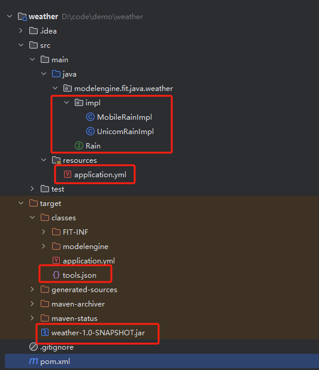

## 插件的基本信息

**插件上传需要首先将插件打包**，当前插件打包**包含三个部分**：

- 工具包（java: jar）。
- 工具的元数据（tools.json）。
- 插件的完整性校验与唯一性校验以及插件的基本信息（plugin.json）。

> 注意：
> 
> * 上传的zip插件必须包含且只能包含以上三个文件；
> * 上传的zip插件的文件命名不可以包含中文；
> * 上传的zip插件不可以解压之后超过100M；

## 插件的示例

当前java框架支持，根据注解@ToolMethod和@Group以及其编译配置，在编译之后的目录下可以生成tools.json以及工具的jar文件。以下是一个插件的demo。



编写插件只需要以下几个步骤：

1. 创建一个project模块，更新pom.xml文件
2. 新建package，新增一个接口与实现，在接口和实现类上均需添加@Group注解，在接口和实现的方法上均需添加@ToolMethod注解，其中接口的方法上添加注解@Genericable，实现的方法上添加@Fitable注解。
3. 插件源码编写完之后，需要添加bean的配置，因为Fitable实现是一个bean，因此需要添加application.yml配置文件
4. 开发完成之后执行mvn clean install，在target/classes目录下存在tools.json即为工具的所有的元数据信息；在target目录下包含目标插件。

下边给定以上插件的基础源码：

**pom.xml文件配置**

```xml
<?xml version="1.0" encoding="UTF-8"?>
<project xmlns="http://maven.apache.org/POM/4.0.0" xmlns:xsi="http://www.w3.org/2001/XMLSchema-instance"
         xsi:schemaLocation="http://maven.apache.org/POM/4.0.0 http://maven.apache.org/xsd/maven-4.0.0.xsd">
    <modelVersion>4.0.0</modelVersion>

    <groupId>modelengine.fit.jade</groupId>
    <artifactId>weather</artifactId>
    <version>1.0-SNAPSHOT</version>

    <properties>
        <maven.compiler.source>17</maven.compiler.source>
        <maven.compiler.target>17</maven.compiler.target>
        <project.build.sourceEncoding>UTF-8</project.build.sourceEncoding>
    </properties>


    <dependencies>
        <dependency>
            <groupId>org.fitframework</groupId>
            <artifactId>fit-api</artifactId>
            <version>3.6.0-SNAPSHOT</version>
        </dependency>
        <dependency>
            <groupId>modelengine.fit.jade.service</groupId>
            <artifactId>tool-service</artifactId>
            <version>1.0.0-SNAPSHOT</version>
        </dependency>
    </dependencies>

    <build>
        <plugins>
            <plugin>
                <groupId>org.fitframework</groupId>
                <artifactId>fit-build-maven-plugin</artifactId>
                <version>3.6.0-SNAPSHOT</version>
                <executions>
                    <execution>
                        <id>build-plugin</id>
                        <goals>
                            <goal>build-plugin</goal>
                        </goals>
                    </execution>
                </executions>
            </plugin>
            <plugin>
                <groupId>modelengine.fit.jade.maven.plugin</groupId>
                <artifactId>tool-maven-plugin</artifactId>
                <version>1.0.0-SNAPSHOT</version>
                <executions>
                    <execution>
                        <id>build-tool</id>
                        <goals>
                            <goal>build-tool</goal>
                        </goals>
                    </execution>
                </executions>
            </plugin>
        </plugins>
    </build>
</project>
```

| 模块                           | 说明                                                         |
| ------------------------------ | ------------------------------------------------------------ |
| fit-api                        | 表示FIT框架中基础的api接口包，其中插件开发必须的@Fitable以及@Genericable注解 |
| tool-service                   | 表示tool工具的服务接口，内部包含@ToolMethod注解以及          |
| build   fit-build-maven-plugin | 用于生成jar文件                                              |
| build  maven-compiler-plugin   | 保证参数的获取                                               |
| build    tool-maven-plugin     | 用于生成tools.json文件                                       |

> 请保证`tool-maven-plugin`编译插件一定放在`fit-build-maven-plugin`类加载编译插件的后面，原因是`tool-maven-plugin`的作用仅仅是扫描四层插件的类用于生成`tools.json`，当插件依赖了外部的接口，而在`Maven`构建过程中先执行`build-tool` 插件时，**包外接口的字节码没有加载到类路径中**​，导致编译时报错`Cannot resolve type description for xxx`。

源码接口

```java
package modelengine.fit.java.weather;

import modelengine.fitframework.annotation.Genericable;
import modelengine.fitframework.annotation.Property;
import modelengine.jade.carver.tool.annotation.Group;
import modelengine.jade.carver.tool.annotation.ToolMethod;

import java.util.List;

@Group(name = "implGroup_weather_Rain_Mobile")
public interface Rain {
    @ToolMethod(name = "rain_today_test", description = "该方法获取今天的下雨信息")
    @Genericable("genericable_weather_rain_today_test")
    String today(@Property(description = "查询地点", required = true) String location);

    @ToolMethod(name = "rain_tomorrow_test", description = "该方法获取明天的下雨信息")
    @Genericable("genericable_weather_rain_tomorrow_test")
    List<String> tomorrow(@Property(description = "查询地点列表", required = true) List<String> location);
}
```

对接口`Rain`的实现`MobileRainImpl`：

```java
package modelengine.fit.java.weather.impl;

import modelengine.fit.java.weather.Rain;
import modelengine.fitframework.annotation.Component;
import modelengine.fitframework.annotation.Fitable;
import modelengine.fitframework.annotation.Property;
import modelengine.jade.carver.tool.annotation.Attribute;
import modelengine.jade.carver.tool.annotation.Group;
import modelengine.jade.carver.tool.annotation.ToolMethod;

import java.util.List;

@Component
@Group(name = "implGroup_weather_Rain_Mobile_test")
public class MobileRainImpl implements Rain {
    private static final String FITABLE_ID = "weather_rain_mobile_test";

    @Fitable(FITABLE_ID)
    @ToolMethod(name = "mobile_rain_today_test", description = "使用A提供的今日下雨信息", extensions = {
            @Attribute(key = "tags", value = "FIT"), @Attribute(key = "tags", value = "TEST")
    })
    @Property(description = "获取今日下雨信息的结果")
    @Override
    public String today(String location) {
        return location;
    }

    @Fitable(FITABLE_ID)
    @ToolMethod(name = "mobile_rain_tomorrow_test", description = "使用A提供的明日下雨信息", extensions = {
            @Attribute(key = "tags", value = "FIT"), @Attribute(key = "tags", value = "TEST")
    })
    @Property(description = "获取明日下雨信息的结果")
    @Override
    public List<String> tomorrow(List<String> location) {
        return location;
    }
}
```

对接口`Rain`的实现`UnicomRainImpl`：

```java
package modelengine.fit.java.weather.impl;

import modelengine.fit.java.weather.Rain;
import modelengine.fitframework.annotation.Component;
import modelengine.fitframework.annotation.Fitable;
import modelengine.jade.carver.tool.annotation.Attribute;
import modelengine.jade.carver.tool.annotation.Group;
import modelengine.jade.carver.tool.annotation.ToolMethod;

import java.util.List;

@Component
@Group(name = "implGroup_weather_Rain_Unicom_test")
public class UnicomRainImpl implements Rain {
    private static final String FITABLE_ID = "weather_rain_unicom_test";

    @Fitable(FITABLE_ID)
    @ToolMethod(name = "unicom_rain_today_test", description = "使用B提供的今日下雨信息", extensions = {
            @Attribute(key = "tags", value = "FIT"), @Attribute(key = "tags", value = "TEST")
    })
    @Override
    public String today(String location) {
        return null;
    }

    @Fitable(FITABLE_ID)
    @ToolMethod(name = "unicom_rain_tomorrow_test", description = "使用B提供的明日下雨信息", extensions = {
            @Attribute(key = "tags", value = "FIT"), @Attribute(key = "tags", value = "TEST")
    })
    @Override
    public List<String> tomorrow(List<String> location) {
        return null;
    }
}
```

> 注意：关于@ToolMethod注解有以下几个声明
> 
> 1. 关于extensions中的@Attribute中的key，value支持 extensions 中相同键支持多值。其中tags为必须填写值，作为工具的标签
> 2. @Property的使用逻辑可以搜索官网，可以设定默认值

> 关于@Genericable和@Fitable注解有以下几个声明
> 
> 1. 对于定义组和实现组下的方法，必须添加@Genericable和@Fitable注解。
> 2. 对于每一个方法，必须在@ToolMethod注解的extension字段添加"FIT"标签。

配置信息 application.yml

```yml
fit:
  beans:
    packages:
    - 'modelengine.fit.java.weather'
```

> 由于Fitable实现有@Component，因此需要声明bean，这里的声明bean是FIT框架声明bean的通用逻辑。

## 插件打包

在插件基本信息中有详细说明，上传插件包需要是zip格式，需含三个文件，分别是插件jar包，工具元数据信息tools.json以及插件的配置信息plugin.json数据，其中，执行mvn clean  install可以生成jar文件以及tools.json文件，plugin.json请根据下文手动编写。这里关于jar文件不在赘述，下面详细说明tools.json文件：

```json{
{
  "version" : "1.0.0",
  "definitionGroups" : [ {
    "name" : "implGroup_weather_Rain_Mobile",
    "summary" : "",
    "description" : "",
    "extensions" : { },
    "definitions" : [ {
      "schema" : {
        "name" : "rain_today_test",
        "description" : "该方法获取今天的下雨信息",
        "parameters" : {
          "type" : "object",
          "properties" : {
            "arg0" : {
              "defaultValue" : "",
              "description" : "查询地点",
              "name" : "arg0",
              "type" : "string",
              "examples" : "",
              "required" : true
            }
          },
          "required" : [ "arg0" ]
        },
        "order" : [ "arg0" ],
        "return" : {
          "type" : "string",
          "convertor" : ""
        }
      }
    }, {
      "schema" : {
        "name" : "rain_tomorrow_test",
        "description" : "该方法获取明天的下雨信息",
        "parameters" : {
          "type" : "object",
          "properties" : {
            "arg0" : {
              "defaultValue" : "",
              "description" : "查询地点列表",
              "name" : "arg0",
              "type" : "array",
              "items" : {
                "type" : "string"
              },
              "examples" : "",
              "required" : true
            }
          },
          "required" : [ "arg0" ]
        },
        "order" : [ "arg0" ],
        "return" : {
          "type" : "array",
          "items" : {
            "type" : "string"
          },
          "convertor" : ""
        }
      }
    } ]
  } ],
  "toolGroups" : [ {
    "name" : "implGroup_weather_Rain_Mobile_test",
    "summary" : "",
    "description" : "",
    "extensions" : { },
    "definitionGroupName" : "implGroup_weather_Rain_Mobile",
    "tools" : [ {
      "schema" : {
        "name" : "mobile_rain_today_test",
        "description" : "使用A提供的今日下雨信息",
        "parameters" : {
          "type" : "object",
          "properties" : {
            "arg0" : {
              "name" : "arg0",
              "type" : "string",
              "required" : false
            }
          },
          "required" : [ ]
        },
        "order" : [ "arg0" ],
        "return" : {
          "name" : "",
          "description" : "获取今日下雨信息的结果",
          "type" : "string",
          "convertor" : "",
          "examples" : ""
        }
      },
      "runnables" : {
        "FIT" : {
          "genericableId" : "genericable_weather_rain_today_test",
          "fitableId" : "weather_rain_mobile_test"
        }
      },
      "extensions" : {
        "tags" : [ "FIT", "TEST" ]
      },
      "definitionName" : "rain_today_test"
    }, {
      "schema" : {
        "name" : "mobile_rain_tomorrow_test",
        "description" : "使用A提供的明日下雨信息",
        "parameters" : {
          "type" : "object",
          "properties" : {
            "arg0" : {
              "name" : "arg0",
              "type" : "array",
              "items" : {
                "type" : "string"
              },
              "required" : false
            }
          },
          "required" : [ ]
        },
        "order" : [ "arg0" ],
        "return" : {
          "name" : "",
          "description" : "获取明日下雨信息的结果",
          "type" : "array",
          "items" : {
            "type" : "string"
          },
          "convertor" : "",
          "examples" : ""
        }
      },
      "runnables" : {
        "FIT" : {
          "genericableId" : "genericable_weather_rain_tomorrow_test",
          "fitableId" : "weather_rain_mobile_test"
        }
      },
      "extensions" : {
        "tags" : [ "FIT", "TEST" ]
      },
      "definitionName" : "rain_tomorrow_test"
    } ]
  }, {
    "name" : "implGroup_weather_Rain_Unicom_test",
    "summary" : "",
    "description" : "",
    "extensions" : { },
    "definitionGroupName" : "implGroup_weather_Rain_Mobile",
    "tools" : [ {
      "schema" : {
        "name" : "unicom_rain_today_test",
        "description" : "使用B提供的今日下雨信息",
        "parameters" : {
          "type" : "object",
          "properties" : {
            "arg0" : {
              "name" : "arg0",
              "type" : "string",
              "required" : false
            }
          },
          "required" : [ ]
        },
        "order" : [ "arg0" ],
        "return" : {
          "type" : "string",
          "convertor" : ""
        }
      },
      "runnables" : {
        "FIT" : {
          "genericableId" : "genericable_weather_rain_today_test",
          "fitableId" : "weather_rain_unicom_test"
        }
      },
      "extensions" : {
        "tags" : [ "FIT", "TEST" ]
      },
      "definitionName" : "rain_today_test"
    }, {
      "schema" : {
        "name" : "unicom_rain_tomorrow_test",
        "description" : "使用B提供的明日下雨信息",
        "parameters" : {
          "type" : "object",
          "properties" : {
            "arg0" : {
              "name" : "arg0",
              "type" : "array",
              "items" : {
                "type" : "string"
              },
              "required" : false
            }
          },
          "required" : [ ]
        },
        "order" : [ "arg0" ],
        "return" : {
          "type" : "array",
          "items" : {
            "type" : "string"
          },
          "convertor" : ""
        }
      },
      "runnables" : {
        "FIT" : {
          "genericableId" : "genericable_weather_rain_tomorrow_test",
          "fitableId" : "weather_rain_unicom_test"
        }
      },
      "extensions" : {
        "tags" : [ "FIT", "TEST" ]
      },
      "definitionName" : "rain_tomorrow_test"
    } ]
  } ]
}
```

> 注意：上述编译生成的tools.json只是辅助生成工具，可能由于pom中逻辑的缺失导致生成的tools.json没有达到最终的预期，因此在使用该tools.json时，需要额外检查一下是否符合当前的规范。

* definitionGroups: 表示各定义组，包括定义组名字和定义组下各定义。
  * [definitionGroup]
    * name: 定义组名字【不允许为空及空白，不允许重复】
    * definitions: 该定义组下各个定义
      * [definition]
        * schema: 表示定义的结构，包括参数的输入，类型以及描述，返回值的描述与类型以及参数传入的顺序，这部分需要符合《json schema规范》。
          * name: 方法名【不允许为空及空白，定义组下的定义名不允许重复】
          * description: 方法描述【不允许为空及空白，不允许重复】
          * parameters: 方法入参
            * type
            * properties
            * required【其数量必须小于等于入参数量，且必须是入参中参数】
          * order: 参数顺序【需要与参数数量一致，且必须是入参中参数】
          * return: 方法出参
* toolGroups:
  * [toolGroup]
    * definitionGroupName: 该实现组实现的定义组的名字 【参考定义组名约束】
    * name: 实现组名字【不允许为空及空白，定义组下的实现组名不允许重复】
    * tools: 该实现组下的方法
      * [tool]
        * definitionName: 该方法实现的定义的名字【参考定义名约束】
        * schema: 方法结构，字段与定义组 schema 一致
        * runnables: 表示对运行规范的描述，包含 FIT 框架信息，来自@Genericable和@Fitable注解
        * extensions: 扩展信息，需要添加标签信息，来自@ToolMethod注解

> 约束情况：
> 
> schema：必须要符合 json schema 规范（网上可以搜索得到，通用的 json 规范）
> 
> * 必须包含name，该值支持中文、英文、数字、空格、中划线、下划线组合
> * 必须包含description，该值被大模型识别，必填项
> * 必须包含parameters，第一层type类型必须为object
> * 必须包含required，内容不可以为properties下参数名之外的参数名
> * 可以包含order，若写必须为properties下的所有参数名的列表，若不写，则默认properties下的所有参数名列表（按顺序）
> * 必须包含return，符合 json schema 格式，其中converter暂时未做处理，可写可不写，默认为空
> 
> runnables：必须包含FIT字段，该字段下必须包含fitableId与genericableId，这里两个值支持FIT调用，可以实现在前端界面准确的调用对应的实现。【fitableId与genericableId 仅支持数字、大小写字母以及 '-'、'_'、'*'、'.' 字符且长度在128以内】
> 
> extension：必须包含tags字段，该字段下包含一个数组，里边的值为对应工具的标签信息

插件元数据信息 plugin.json

```json
{
  "checksum": "dc2306935b8dfd838cd877ca618fb68791779876a1737cba2d89c1e404344e55",
  "name":"天气服务",
  "description":"这是一个天气服务工具",
   "type": "java",
   "uniqueness": {
      "artifactId": "jade-demo-parent",
      "groupId": "store-demo-plugin"
   }
}
```

| 参数名      | 说明                                                         |
| ----------- | ------------------------------------------------------------ |
| checksum    | 表示用户打包的源码插件文件的SHA-256的值，这里作为完整性校验的标识。**这里建议使用git bash 执行sha256sum.exe xxx.jar生成该值** |
| description | 插件的描述信息。                                             |
| name        | 插件名称。                                                   |
| type        | 插件的类型。                               |
| uniqueness| 插件的唯一性标识。uniqueness 包含两个参数：artifactId、groupId。这些需要用户自定义，保证新增插件与之前插件的不同。**注意这些字段不可以使用空格以及中文，请符合标准的命名规范，使用英文或数字，中间以中划线分割** |

> 注意上述自字段均为必填字段。
